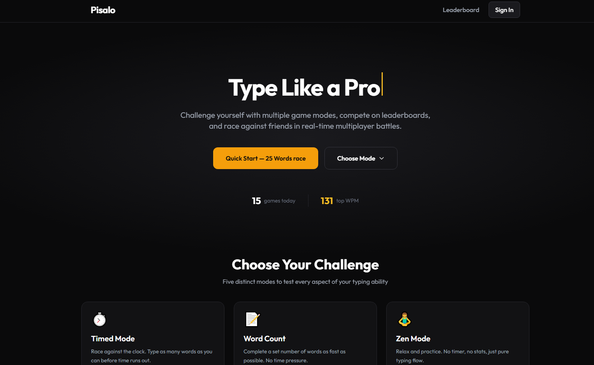
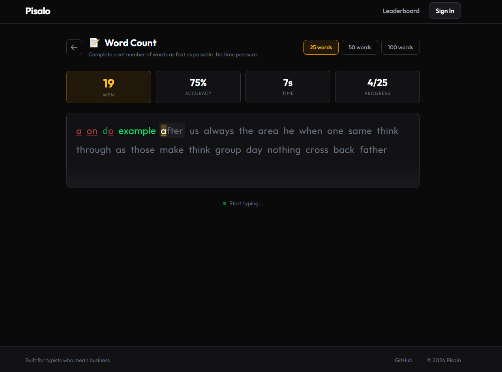
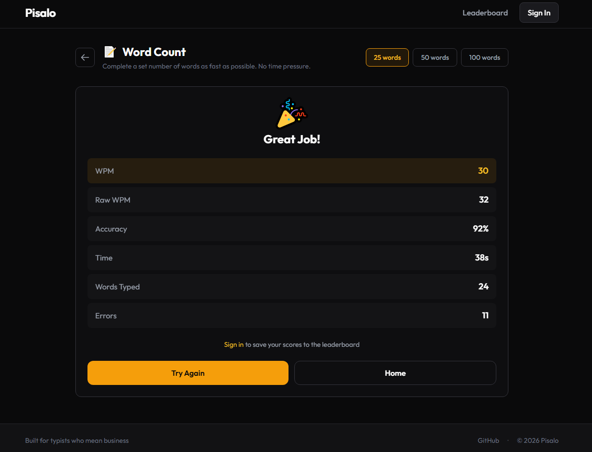
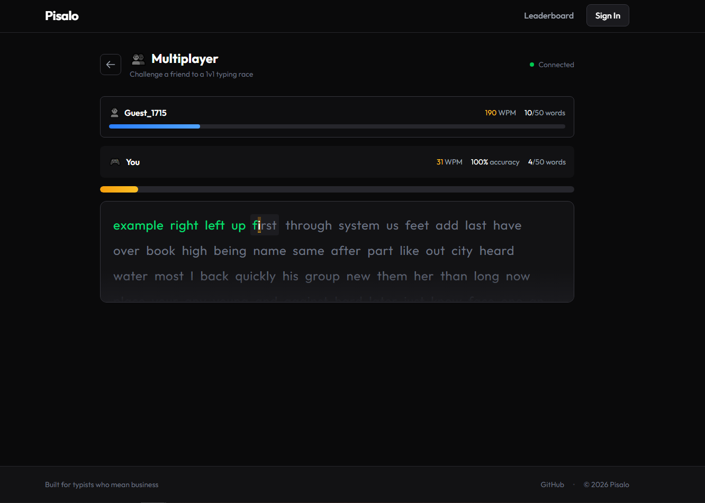
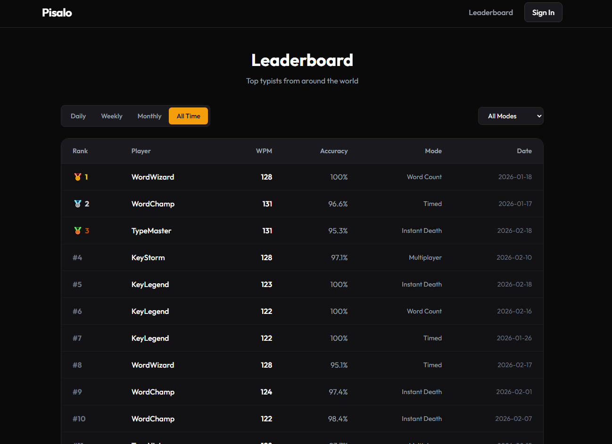

# Pisalo

A modern typing speed test and racing game with real-time multiplayer support. Challenge yourself across multiple game modes, compete on leaderboards, and race against friends.

## Features

- **Multiple Game Modes**
    - **Timed Mode** — Race against the clock (15s, 30s, or 60s)
    - **Word Count** — Complete a set number of words (25, 50, or 100)
    - **Zen Mode** — Practice without pressure, no timer or stats
    - **Instant Death** — One mistake ends the game
    - **Multiplayer** — Real-time races against other players

- **Real-time Multiplayer** — Race against friends or strangers with live progress tracking
- **Leaderboards** — Compete for the top WPM scores (daily/all-time)
- **GitHub OAuth** — Sign in with your GitHub account
- **Modern UI** — Clean, responsive design with smooth animations

## Screenshots

<!-- Replace placeholder paths with actual screenshots -->

### Home Page



### Typing Game



### Game Results



### Multiplayer Race



### Leaderboard



## Tech Stack

### Frontend

- React 19 with TypeScript
- Vite 7
- Tailwind CSS 4
- Zustand (state management)
- React Router 7
- SignalR (real-time communication)

### Backend

- .NET 10 (Minimal API)
- Entity Framework Core
- PostgreSQL 16
- SignalR (WebSocket hubs)
- JWT Authentication
- GitHub OAuth

## Prerequisites

- [Node.js](https://nodejs.org/) 20+
- [.NET 10 SDK](https://dotnet.microsoft.com/download)
- [Docker](https://www.docker.com/) (for PostgreSQL)

## Getting Started

### 1. Clone the repository

```bash
git clone <repository-url>
cd pisalo
```

### 2. Start the database

```bash
docker-compose up -d
```

This starts a PostgreSQL container on port `6432`.

### 3. Configure the backend

Create a `.env` file in the `backend` directory (use `.env.example` as reference):

```env
# OAuth Configuration
OAuth__GitHub__ClientId=your-github-client-id
OAuth__GitHub__ClientSecret=your-github-client-secret

# JWT Settings
JwtSettings__Secret=your-super-secret-key-at-least-32-characters-long

# Database Connection
ConnectionStrings__DefaultConnection=Host=localhost;Port=6432;Database=pisalo;Username=postgres;Password=postgres
```

### 4. Run database migrations

```bash
cd backend
dotnet ef database update
```

### 5. Start the backend

```bash
cd backend
dotnet run
```

The API runs at `http://localhost:5042`.

### 6. Start the frontend

```bash
cd frontend
npm install
npm run dev
```

The app runs at `http://localhost:5173`.

## Project Structure

```
pisalo/
├── backend/                 # .NET API
│   ├── Data/               # Database context & seeders
│   ├── DTOs/               # Data transfer objects
│   ├── Endpoints/          # API endpoint definitions
│   ├── Entities/           # Database entities
│   ├── Hubs/               # SignalR hubs
│   ├── Migrations/         # EF Core migrations
│   ├── Services/           # Business logic
│   └── Program.cs          # Application entry point
├── frontend/               # React application
│   └── src/
│       ├── components/     # React components
│       ├── hooks/          # Custom hooks
│       ├── mocks/          # Mock data
│       ├── pages/          # Page components
│       ├── services/       # API services
│       ├── store/          # Zustand stores
│       └── types/          # TypeScript types
└── docker-compose.yml      # PostgreSQL container
```

## API Endpoints

| Method | Endpoint           | Description             |
| ------ | ------------------ | ----------------------- |
| GET    | `/health`          | Health check            |
| GET    | `/api/leaderboard` | Get leaderboard entries |
| POST   | `/api/auth/github` | GitHub OAuth flow       |

### SignalR Hubs

- `/hubs/game` — Real-time game events (multiplayer races)

## Environment Variables

### Backend (`backend/.env`)

| Variable                               | Description                               |
| -------------------------------------- | ----------------------------------------- |
| `OAuth__GitHub__ClientId`              | GitHub OAuth app client ID                |
| `OAuth__GitHub__ClientSecret`          | GitHub OAuth app client secret            |
| `JwtSettings__Secret`                  | Secret key for JWT signing (min 32 chars) |
| `ConnectionStrings__DefaultConnection` | PostgreSQL connection string              |

### Frontend (`frontend/.env`)

| Variable       | Description                                        |
| -------------- | -------------------------------------------------- |
| `VITE_API_URL` | Backend API URL (default: `http://localhost:5042`) |

## License

MIT
